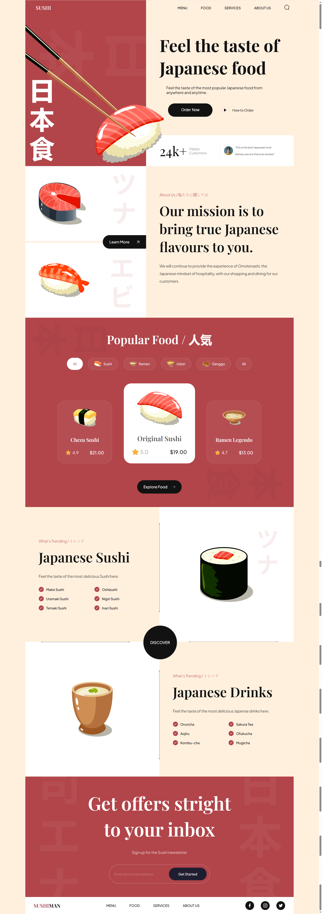

## Screenshot



# Sushi Website

A modern and responsive Japanese sushi restaurant website.

## Features

- Responsive design
- Smooth animations (AOS)
- Modern CSS Grid and Flexbox
- Interactive menu and gallery
- Mobile-first approach

## Technologies

- HTML5
- CSS3
- JavaScript (ES6+)
- AOS (Animate On Scroll)
- Vite (Build tool)

## Installation

```bash
npm install
npm run dev
```

